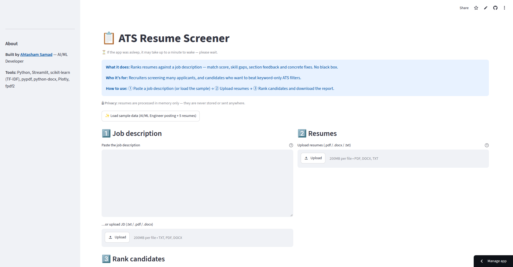

# 📋 ATS Resume Screener

Rank resumes against a job description — match score, skill gaps, section feedback and concrete fixes. No black box.

**Live demo:** https://ai-portfolio-et3o8xwtmckpkuk2rynywq.streamlit.app/

## Screenshots



## Features

- Paste a job description (or upload it) and upload **multiple resumes** (PDF, DOCX, TXT)
- **"Try with sample"** — AI/ML Engineer posting + 5 sample resumes, one click
- **Ranked shortlist** with gauge chart, TF-IDF similarity and skill-overlap metrics
- **Matched / missing skill pills**, per-candidate expanders
- **Section-wise feedback** (Skills, Experience, Education, Formatting)
- **3–5 concrete suggestions** per candidate (missing keywords, quantified achievements, …)
- **Downloads:** ranking CSV + full **PDF report**
- 🔒 **Privacy:** resumes are processed in memory only — never stored or sent anywhere
- Friendly error handling: corrupt/encrypted/scanned PDFs, bad Word files, empty uploads

## Tech stack

Python · Streamlit · scikit-learn (TF-IDF) · pypdf · python-docx · Plotly · fpdf2 · pandas

## Run locally

```bash
git clone https://github.com/ahtashamsamad/ai-portfolio.git
cd ai-portfolio/ats-resume-screener
pip install -r requirements.txt
streamlit run app.py
```

## How it works

Score = **0.6 × TF-IDF cosine similarity** (job description vs resume wording) + **0.4 × skill overlap** (share of the posting's listed skills found in the resume), scaled to 0–100. Common abbreviations are expanded before matching (ML → machine learning), so candidates aren't punished for vocabulary mismatch — the exact problem keyword-only ATS systems have.

Scores rank candidates for **shortlisting only** — they are similarity measurements, not hiring decisions.

## Future improvements

- Embedding-based semantic matching
- Parsing structured fields (experience years, location)
- Team workspaces and saved screenings

## Author

**Ahtasham Samad** — AI/ML Developer
Upwork: https://www.upwork.com/freelancers/~01d75561be7a2cd578
