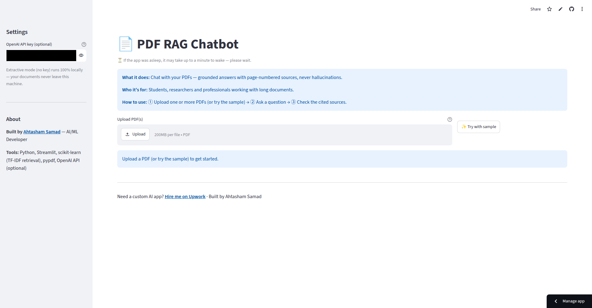

# 📄 PDF RAG Chatbot

Chat with your PDFs — grounded answers with page-numbered sources, never hallucinations.

**Live demo:** https://ai-portfolio-jwev4baznf4cjwf5hv6wdx.streamlit.app/

## Screenshots



## Features

- Upload **multiple PDFs** (or try the bundled sample — no upload needed)
- Answers **stream in live** and cite **page-numbered sources** per document
- **Grounded by design:** questions not covered by the documents get an honest *"not in the document"* reply instead of a hallucination
- Auto-generated **document summary** after indexing
- Chat history in `st.session_state`, **Clear chat** button, **download chat as TXT**
- Optional OpenAI key (via `st.secrets`, sidebar fallback) upgrades extractive answers to natural-language ones — without a key everything runs 100% locally
- Friendly error handling: wrong file type, empty/corrupt/encrypted/scanned PDFs, oversized files, API failures

## Tech stack

Python · Streamlit · scikit-learn (TF-IDF retrieval) · pypdf · OpenAI API (optional)

## Run locally

```bash
git clone https://github.com/ahtashamsamad/ai-portfolio.git
cd ai-portfolio/pdf-rag-chatbot
pip install -r requirements.txt
# optional: copy .streamlit/secrets.toml.example to .streamlit/secrets.toml
# and add your OPENAI_API_KEY
streamlit run app.py
```

## How it works

1. Each PDF is extracted page-by-page with pypdf and split into ~300-word sentence-aware passages (50-word overlap), tagged with page numbers.
2. Your question is matched against all passages with TF-IDF cosine similarity; the top-3 passages are retrieved.
3. If the best match scores below a relevance threshold, the app honestly says the answer isn't in the documents.
4. Otherwise the answer is composed — extractively from the passages, or by an LLM grounded *only* on the retrieved passages when an API key is provided.

## Future improvements

- Hybrid dense + sparse retrieval (embeddings)
- Multi-language PDFs and OCR for scanned documents
- Conversation memory across documents

## Author

**Ahtasham Samad** — AI/ML Developer
Upwork: https://www.upwork.com/freelancers/~01d75561be7a2cd578
